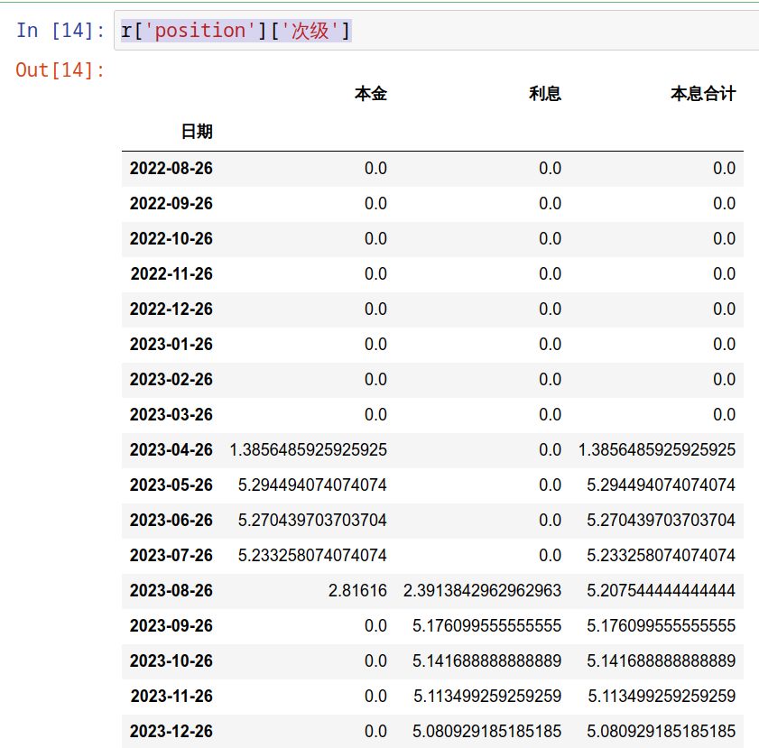
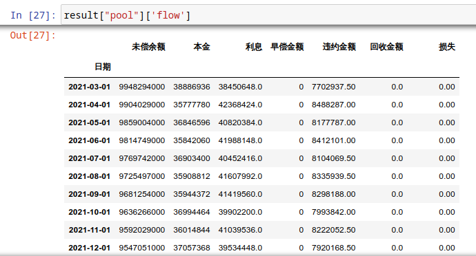
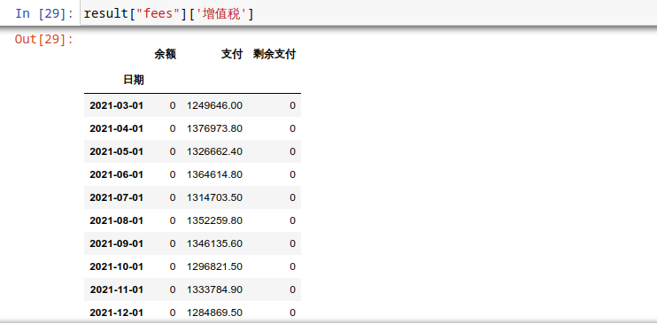
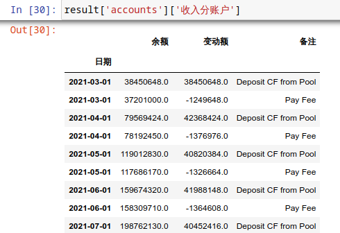
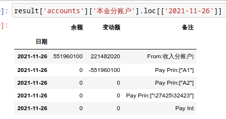
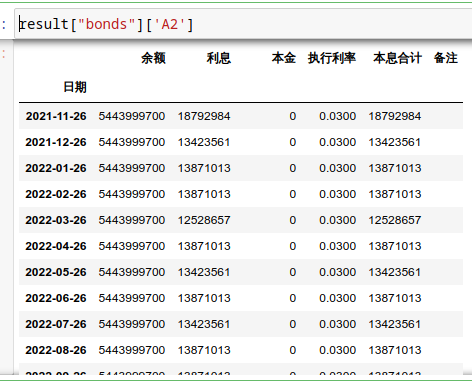
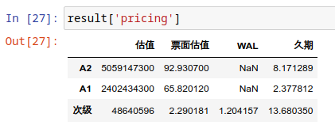

分析
*****

首先需要实例化一个计算服务器，这里有一个公共服务器：

.. code-block:: python

   from absbox import API,save
   from absbox.local.china import 信贷ABS,show
   localAPI = API("https://deal-bench.xyz/api")

``"https://deal-bench.xyz/api"`` 可以替换成本地部署,或者私有云的服务器，以提高响应速度和计算能力。

.. note::
   计算服务器是基于REST Service 引擎,`absbox`通过HTTP协议和这个引擎进行交互。
   引擎代码存放在 `Hastructure <https://github.com/yellowbean/Hastructure>`_

实例化完成之后，便可以调用"``run()``"方法对已经建模的产品进行分析。

.. code-block:: python

  localAPI.run(jy,    # 这里 jy 就表示一个ABS产品模型
               assumptions=[{"CPR":0.01}  # 年化早偿付率 1%
                           ,{"CDR":0.01}  # 年化违约率  1%
                           ,{"回收":(0.7,18)}],  # 回收率 70%，回收周期 18
               pricing={"贴现日":"2023-06-22"
                       ,"贴现曲线":[["2020-01-01",0.025]]},
               read=True
              )

如果 模型文件已经通过下列命令存储至本地目录

.. code-block:: python

    save(jy, "test02.obj")

那么 通过传入指定本地文件路径运行分析

.. code-block:: python

    localAPI.run("test02.obj"
            ,assumptions=[{"CPR":0.01},{"CDR":0.01},{"回收":(0.7,18)}]
            ,read=True)

参数
====
1. ABS产品模型
----
第一个参数为需要分析的 ``产品模型`` 对象 , 该对象是通过 建模 页面对产品要素进行建模后的对象。

2. assumptions
----
用户需要传入一个map的列表。每一个map分别代表着: 资产池假设,清仓回购假设,利率曲线设定.

2.1 资产池假设
^^^^
针对不同底层资产类别， 用户可以传入不同的资产池假设。

* 居民住房按揭贷款
   * ``{"CPR":0.01}`` , 假设资产池年化早偿率为1%
   * ``{"CDR":0.01}`` , 假设资产池年化违约率为1%
   * ``{"回收":(0.7,18)`` ,假设资产违约后，回收率为 70%,回收周期为 18 .

.. note::
    如果资产付款周期为 *月* 的话, 那么18 表示 18月 之后，将会有 70%的违约金额会变成回收金额进入资产池。

2.2 利率假设
^^^^

利率假设将会用于未来债券和资产池的测算。 用户通过传入一个map:

  * key 为 ``利率``
  * value 为 ``[利率名称,[[起始日期,利率值]]]``

``{"利率":["LPR5Y",[["2022-01-01",0.05],["2022-08-01",0.18],["2023-08-01",0.1]]]}``
表示： 基准利率LPR5Y，2022-1-1时，利率为5%，2022-8-1,利率为18%, 2023-8-1,利率为10%。

2.3 清仓回购假设
^^^^
格式为 ``[[清仓触发条件],清仓计价方式,回款存入账户]``

  * ``清仓触发条件``, 条件是一个列表， 当列表内所有触发条件都满足情况下，就会触发清仓回购动作。

.. code-block:: python

   {"清仓":[{"资产池余额剩余比率":0.2}]}
   {"清仓":[{"指定日之后":"2024-01-01"}]}

2.5 债券持仓现金流
^^^^

用户可以通过参数 `position` 传入持仓债券的张数和对应层级，从而获取对应债券实际获得的现金流

.. code-block:: python

  r = localAPI.run(BYD_AUTO_2021_2
             ,assumptions= myAssumption
             ,pricing= myPricing
             ,read=True
             ,position={"次级":2000}
             )

通过加入一个`position`参数，传入当前持仓的名称，持仓的债券张数

.. code-block:: python

  r['position']['次级']

即可获取基于持仓的现金流

2.6 多情景分析 
^^^^
如果 ``assumptions`` 传入嵌套列表，那么引擎就会针对嵌套内的每一个情景进行计算。
此时返回的运算结果是一个 *列表* ，对应每次假设场景的计算结果。

.. code-block:: python

    import numpy as np
    
    cprs = np.quantile([0.02232,0.03408],[0,0.25,0.75,1])
    cdrs = np.quantile([0.00119, 0.00239],[0,0.5,1])
    
    scenarioAssumptions = [ 
        [{"CPR":cpr}
         ,{"回收":(0.5,12)}
         ,{"CDR":cdr}
         ,{"清仓":[{"资产池余额剩余比率":0.15}]}]
        for cpr in list(cprs)
        for cdr in list(cdrs)
    ]    
    
    r_list = localAPI.run(BYD_AUTO_2021_2
                 ,assumptions= scenarioAssumptions
                 ,read=True)
    # 注意 r_list 是一个列表

3. pricing
----

3.1 贴现曲线
^^^^^

  * 贴现日:  引擎会把贴现日之后的债券现金（现金=本金+利息）流进行贴现
  * 贴现曲线:  传入一个列表，列表格式为 [``日期``, ``贴现率``]

.. code-block:: python

  {"贴现日":"2023-06-22","贴现曲线":[["2020-01-01",0.03]]}

3.2 贴现日
^^^^^

将贴现日之后的债券现金流，贴现至贴现日

4. read
----
* ``True`` -> 表示把结果读取成 ``pandas.DataFrame``
* ``False`` -> 表示把结果读取为json

结果获取
====
通过调用 `run()` 方法，``absbox`` 会发送一个HTTP请求到 API引擎，并且解析返回结果。

.. code-block:: python

    result = localAPI.run(deal,
             assumptions=....,
             pricing=....,
             read=True)

当调用完成后，运行结果会存入变量 ``result`` 中

资产池现金流
----

* ``result['pool']['flow']``

费用现金流
----

* ``result['fees']``

账户流水
----

* ``result['accounts']['本金分账户']`` 获取``本金分账户``的现金流

* ``result['accounts']['本金分账户'].loc[['2021-11-26']]`` ，获取 ``2021-11-26`` 日所有该账户收支明细

债券现金流
----

* ``result['bonds']`` 即可获取所有债券现金流
* ``result['bonds']['A1']`` 即可获取债券 ``A1`` 债券的现金流

整体概览
----
如果调用 ``show()`` 对整个现金流分配进行概览，包括展示从资产池，账户，费用，以及债券支付情况。

.. code-block:: python

  show(result)

债券估值/久期/WAL/应计利息
----

按照``run()``参数``pricing``传入的内容，对债券进行估值。结果可以通过``pricing``查看

.. code-block:: python

  result['pricing']

保存为HTML
----

通过使用 ``float_format`` 参数

* ``lambda x: '{:,.2f}'.format(x)`` 对 大金额数字进行逗号分割。
* ``str`` -> 普通数字显示（非默认的科学技术法）

.. code-block:: python

    show(result).to_html(r"path/result.html",float_format=lambda x: '{:,.2f}'.format(x))

