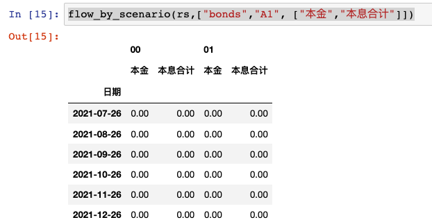
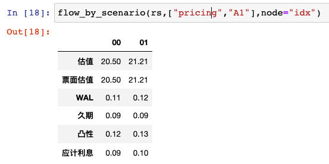

分析
*****

首先需要初始化计算服务器，这里有一个公共服务器：

.. code-block:: python

   from absbox import API,save,SPV
   localAPI = API("https://absbox.org/api/latest")

``"https://absbox.org/api/latest"`` 可替换成本地部署,或者私有云的服务器，以提高响应速度和计算能力。公共完整列表请参考 `absbox.org <https://absbox.org>`_

.. note::
   计算服务器是基于RESTful Service 引擎, ``absbox`` 通过HTTP协议与引擎进行交互。
   引擎代码托管于 `Hastructure <https://github.com/yellowbean/Hastructure>`_

实例化完成后，可调用 ``run()`` 方法对已经建模的产品进行分析。

.. code-block:: python

  localAPI.run(jy,    # 这里 jy 就表示一个ABS产品模型
               poolAssump = <资产池表现假设>,
               runAssump  = <产品运行假设> ,
               read=True
              )

参数
=======
1. ABS产品模型
---------------
第一个参数为需要分析的 ``产品模型`` 对象 , 该对象是通过 建模 页面对产品要素进行建模后的对象。

2. 资产池表现假设
-------------------
针对不同底层资产类别， 用户可以传入不同的资产池假设。

2.1 住房按揭/工商贷款/消费贷款
""""""""""""""""""""""""""""

.. code-block:: python

  ("Pool",("Mortgage",{"CDR":0.01},{"CPR":0.01},{"Rate":0.7,"Lag":18},None)
          ,None
          ,None)

输入
  * ``违约假设``

    * ``{"CDR":0.01}`` -> 年化违约率 
    * ``{"CDR":[0.01,0.02,0.0]}`` -> 年化违约率曲线
  * ``早偿假设``
    
    * ``{"CPR":0.01}`` -> 早偿率 
    * ``{"CPR":[0.01,0.02,0.0]}`` -> 早偿率曲线
  * ``回收假设``
  
    * ``{"Rate":0.7,"Lag":18}``

.. note::
    如果资产付款周期为 *月* 的话, 那么18 表示 18月 之后，将会有 70%的违约金额会变成回收金额进入资产池。

2.2 租赁合同
""""""""""""""""""

.. code-block:: python

  ("Pool",("Lease",<turnover gap>,<rental assump>,<end date>)
                  ,None
                  ,None
                  )

输入
  * ``间隔假设`` : 新模拟合同之间的间隔

    * ``{"Days":30}`` 模拟合同之间间隔30天
  * ``租金假设`` : 模拟合同的租金涨幅

    * ``{"AnnualIncrease":0.05}`` -> 年化涨幅 5%
    * ``{"CurveIncrease": [["2021-01-01",0.05],["2022-01-01",0.06]]}`` -> 按曲线涨幅
  * ``结束日期`` : 模拟合同的结束日期

    * ``"2020-01-01"``

3. 运行假设
------------

``运行假设``作为一个列表,需要传入参数 ``runAssump``

利率假设
""""""""

利率假设将会用于未来债券和资产池的测算。

.. code-block:: python

  r = localAPI.run(test01
                  ,runAssump=[("interest"
                              ,("LPR5Y",0.04)
                              ,("LPR1Y",[["2021-01-01",0.025]
                                        ,["2022-08-01",0.029]]))]
                  ,read=True)

表示： 基准利率LPR1Y，2022-1-1时，利率为2.5%，2022-8-1,利率为2.9%。

清仓回购假设
""""""""

当列表内所有触发条件都满足情况下，触发清仓回购动作。

.. code-block:: python

  ("call",{"poolBalance":200},{"bondBalance":100})

  ("call",{"poolBalance":200} # clean up when pool balance below 200
         ,{"bondBalance":100} # clean  up when bond balance below 100
         ,{"poolFactor":0.03} # clean up when pool factor below 0.03
         ,{"bondFactor":0.03} # clean up when bond factor below 0.03
         ,{"afterDate":"2023-06-01"} # clean up after date 2023-6-1
         ,{"or":[{"afterDate":"2023-06-01"} # clean up any of them met
                 ,{"poolFactor":0.03}]}
         ,{"and":[{"afterDate":"2023-06-01"} # clean up all of them met
                 ,{"poolFactor":0.03}]}
         ,{"and":[{"afterDate":"2023-06-01"} # nested !!
                  ,{"or":
                     [{"poolFactor":0.03}
                     ,{"bondBalance":100}]}]})

循环资产假设
""""""""

参数
  * 循环资产列表
  * 循环资产表现假设

.. code-block:: python

  ("revolving"
  ,["constant",revol_asset1,revol_asset2.....]
  ,("Pool",("Mortgage",{"CDR":0.07},None,None,None)
            ,None
            ,None))

查看中间变量
""""""""""""""

通过传入 ``<公式>`` 和 ``<datePattern>`` 的组合,引擎会返回对应日期下公式的值

.. code-block:: python

    ("inspect",("MonthEnd",("poolBalance",))
              ,("QuarterFirst",("bondBalance",))
              ,....)

财务报表
""""""""""""

通过传入 ``<datePattern>`` ,获取基于日期序列下的 ``资产负债表`` 和 ``现金流量表``

.. code-block:: python

    ("report",{"dates":"MonthEnd"})

提前停止测算
""""""""""""""

测算将会进行到 ``2023-9-1`` 为止。

.. code-block:: python

    ("stop","2023-09-01")

债券估值
""""""""""""

参数

  * 贴现日:贴现日之后的债券现金（现金=本金+利息）
  * 贴现曲线:传入列表，列表格式为 [``日期``, ``贴现率``]

.. code-block:: python

  ("pricing"
  ,{"date":"2021-08-22"
   ,"curve":[["2021-01-01",0.025]
            ,["2024-08-01",0.025]]})
  
  ("pricing"
  ,{"贴现日":"2021-08-22"
   ,"贴现曲线":[["2021-01-01",0.025]
            ,["2024-08-01",0.025]]})

费用假设
""""""""""""

对于自定义费用，用户可以通过传入 ``runAssump`` 对未来的费用发生额进行估计。

.. code-block:: python

  # fee in the deal model
  ,(("trusteeFee",{"type":{"fixFee":30}})

      ,("tsFee",{"type":{"customFee":[["2024-01-01",100]
                                    ,["2024-03-15",50]]}})
      ,("tsFee1",{"type":{"customFee":[["2024-05-01",100]
                                      ,["2024-07-15",50]]}})
    )

  # assumption to override
  r = localAPI.run(test01
              ,runAssump=[("estimateExpense",("tsFee"
                                              ,[["2021-09-01",10]
                                                ,["2021-11-01",20]])
                                              ,("tsFee1"
                                              ,[["2021-12-01",10]
                                                ,["2022-01-01",20]])
                          )]
              ,read=True)

4. read
---------
* ``True`` -> 表示把结果读取成 ``pandas.DataFrame``
* ``False`` -> 表示把结果读取为json

结果获取
=========
通过调用 ``run()`` 方法， ``absbox`` 会发送一个HTTP请求到 API引擎，并且解析返回结果。

.. code-block:: python

    result = localAPI.run(deal,
                          poolAssump=....,
                          runAssump=....,
                          read=True)

调用后，运算结果会存入变量 ``result`` 中

资产池现金流
---------------

* ``result['pool']['flow']``

.. image:: img/pool_flow.png
  :width: 400
  :alt: 资产池现金流

费用现金流
-----------

* ``result['fees']``

.. image:: img/fee_flow2.png
  :width: 400
  :alt: 费用

账户流水
--------

* ``result['accounts']['本金分账户']`` 获取``本金分账户``的现金流

.. image:: img/acc_flow.png
  :width: 400
  :alt: 账户

* ``result['accounts']['本金分账户'].loc[['2021-11-26']]`` ，获取 ``2021-11-26`` 日所有该账户收支明细

.. image:: img/acc_day.png
  :width: 400
  :alt: 账户2

债券现金流
-----------

* ``result['bonds']`` 即可获取所有债券现金流
* ``result['bonds']['A1']`` 即可获取债券 ``A1`` 债券的现金流

.. image:: img/bond_flow.png
  :width: 400
  :alt: 债券现金流

债券持仓现金流
----------------

.. code-block:: python

  from absbox.local.util import positionFlow

  r = localAPI.run()
  
  positionFlow(r, {'优先A1级':15000000.0} )

债券损失金额
-----------

* ``result['result']['bonds']`` 

.. image:: img/bond-defaults.png
  :width: 300
  :alt: 债券违约

流动性支持流水
-------------

* ``result['liqProvider']["流动性支持方名称"]`` 

保存为HTML
-------------

通过使用 ``float_format`` 参数

* ``lambda x: '{:,.2f}'.format(x)`` 对 大金额数字进行逗号分割。
* ``str`` -> 普通数字显示（非默认的科学计数法）

.. code-block:: python

    show(result).to_html(r"path/result.html",float_format=lambda x: '{:,.2f}'.format(x))

债券估值/久期/WAL/应计利息
-------------------------

按照 ``run()`` 参数 ``pricing`` 传入的内容，对债券进行估值。
结果可以通过 ``pricing`` 查看

.. code-block:: python

  result['pricing']

.. image:: img/pricing.png
  :width: 400
  :alt: 估值

债券 静态利差
-------------------------

.. code-block:: python

  result = localAPI.run(test01,
           assumptions=None,
           pricing={"债券":{"A1":("2021-10-15",80)},"利率曲线":[["2020-01-01",0.03],["2024-01-01",0.03]]},
           read=True)
  result['pricing']

.. image:: img/z-spread.png
  :width: 150
  :alt: z-spread

内部收益率测算
--------------

支持基于 ``pyxirr`` 对 债券 的IRR进行计算. 需要传入的参数是初始投资时间和初始投资金额.

.. code-block:: python

  irr(result['bonds']['A1'],("2023-01-01",1000))

多情景分析 
============

用户通过设定多个情景，作为字典传入 `assumptions` 。提交运行后，引擎返回字典，key为场景名字，value为对应场景下的计算结果。

.. code-block:: python
  myAssumption = ("Pool",("Mortgage",{"CDR":0.01},None,None,None)
                                ,None
                                ,None)

  myAssumption2 = ("Pool",("Mortgage",None,{"CPR":0.01},None,None)
                                  ,None
                                  ,None)

  r = localAPI.run(test01
              ,poolAssump={"00":myAssumption
                          ,"stressed":myAssumption2}
              ,read=True)

  # 获取场景 ‘00’ 的结果 
  r["00"]

多情景的现金流对比 
----------------

用户可以通过 ``flow_by_scenario`` 查看多情景下的，特定现金流（资产池/账户/费用/债券等）对比。 

.. code-block:: python 

  from absbox import flow_by_scenario

  flow_by_scenario(rs,["pool","flow","利息"])
  flow_by_scenario(rs,["bonds","A1","本金"])

.. image:: img/flow_by_scenario.png 
  :width: 450
  :alt: fbs

如需对比多字段，可在最后元素传入dataframe的列表

.. code-block:: python 

  flow_by_scenario(rs,["bonds","A1", ["本金","本息合计"]])

如果对应查询数据是row index，那么：

.. code-block:: python 

  flow_by_scenario(rs,["pricing","A1"],node="idx")

资产明细级别风险参数设置
======================

如果存在底层清单, 用户可以对资产池内所有的资产进行分组,然后每个组使用特定的风险参数.

如下面示例, 构造两个风险参数组 ``Asset01Assump`` ``Asset02Assump``.
然后,在下面 ``([0],Asset01Assump)``,表示 风险参数 ``Asset01Assump`` 将会作用于 下标为 0 的资产.
同理,如果需要将这个风险参数作用于多个资产,则可以增加下标 ``([0,1,2,5],Asset01Assump)``  将会作用于下标0,1,2,5的资产.

.. code-block:: python 

  myAsset1 = ["Mortgage"
              ,{"originBalance": 12000.0
               ,"originRate": ["fix",0.045]
               ,"originTerm": 120
               ,"freq": "monthly"
               ,"type": "level"
               ,"originDate": "2021-02-01"}
              ,{"currentBalance": 10000.0
               ,"currentRate": 0.075
               ,"remainTerm": 80
               ,"status": "current"}]
  myAsset2 = ["Mortgage"
              ,{"originBalance": 12000.0
               ,"originRate": ["fix",0.045]
               ,"originTerm": 120
               ,"freq": "monthly"
               ,"type": "level"
               ,"originDate": "2021-02-01"}
              ,{"currentBalance": 10000.0
               ,"currentRate": 0.075
               ,"remainTerm": 80
               ,"status": "current"}]
  
  myPool = {'assets':[myAsset1,myAsset2],
            'cutoffDate':"2022-03-01"}
  
  Asset01Assump = (("Mortgage"
                   ,{"CDR":0.01} ,{"CPR":0.1}, None, None)
                   ,None
                   ,None)
  Asset02Assump = (("Mortgage"
                   ,{"CDR":0.2} ,None, None, None)
                   ,None
                   ,None)
  
  AssetLevelAssumption = ("ByIndex"
                          ,([0],Asset01Assump)
                          ,([1],Asset02Assump))
  
  r = localAPI.runPool(myPool
                     ,poolAssump=AssetLevelAssumption
                     ,read=True)

    

单独资产池现金流计算
====================

用户可以构造单独的资产池进行现金流测算,并伴随施加一定的压力参数

.. code-block:: python 

    from absbox import SPV,API
    localAPI = API("http://localhost:8081")
    
    
    mypool = {'清单':[["按揭贷款"
            ,{"放款金额":120,"放款利率":["固定",0.045],"初始期限":30
              ,"频率":"每月","类型":"等额本息","放款日":"2021-02-01"}
              ,{"当前余额":120
              ,"当前利率":0.10
              ,"剩余期限":5
              ,"状态":"正常"}]],
             '封包日':"2021-04-04"}
    
    
    localAPI.runPool(mypool,assumptions=[])

