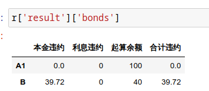
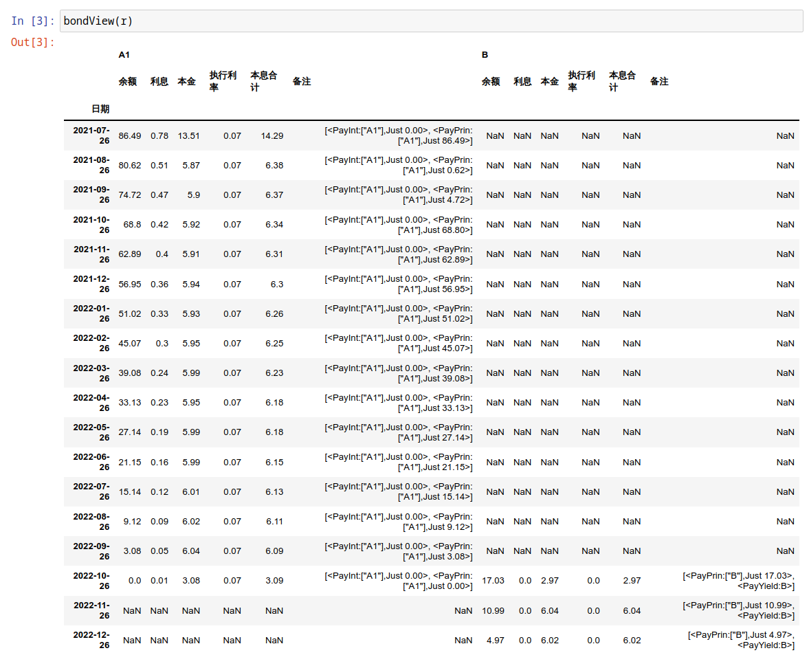
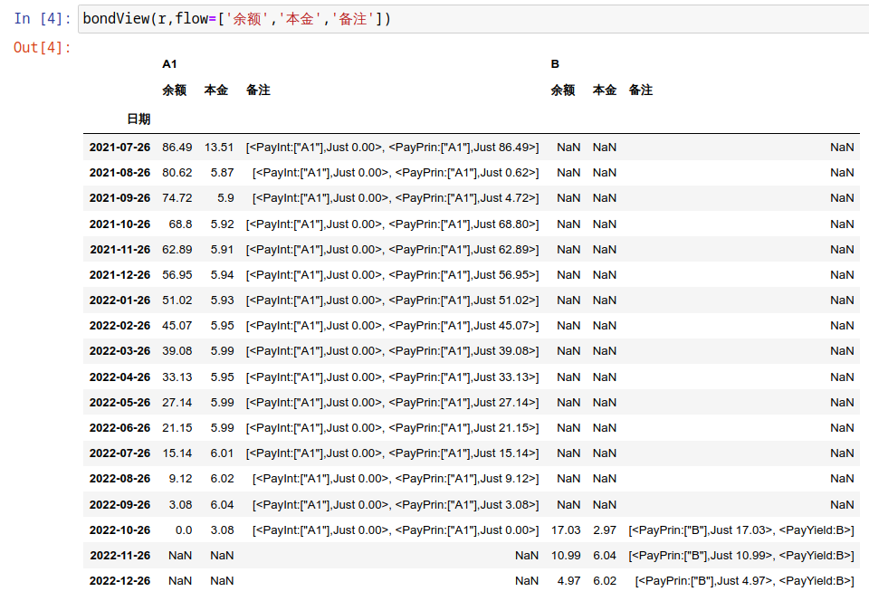
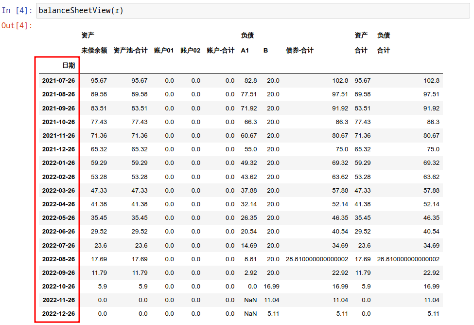
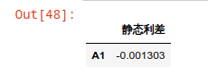
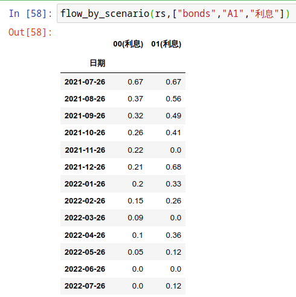
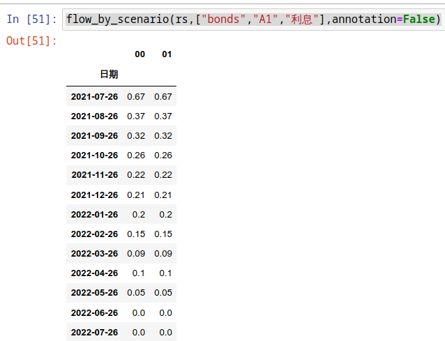

分析
*****

首先需要初始化计算服务器，这里有一个公共服务器：

.. code-block:: python

   from absbox import API,save
   from absbox.local.china import SPV,show
   localAPI = API("https://absbox.org/api/latest")

``"https://absbox.org/api/latest"`` 可以替换成本地部署,或者私有云的服务器，以提高响应速度和计算能力。完整列表请参考 `absbox.org <https://absbox.org>`_

.. note::
   计算服务器是基于RESTful Service 引擎, ``absbox`` 通过HTTP协议与引擎进行交互。
   引擎代码存放在 `Hastructure <https://github.com/yellowbean/Hastructure>`_

实例化完成之后，便可以调用 ``run()`` 方法对已经建模的产品进行分析。

.. code-block:: python

  localAPI.run(jy,    # 这里 jy 就表示一个ABS产品模型
               assumptions=[{"CPR":0.01}  # 年化早偿付率 1%
                           ,{"CDR":0.01}  # 年化违约率  1%
                           ,{"回收":(0.7,18)}],  # 回收率 70%，回收周期 18
               pricing={"贴现日":"2023-06-22"
                       ,"贴现曲线":[["2020-01-01",0.025]]},
               read=True
              )

如果 模型文件已经通过下列命令存储至本地目录

.. code-block:: python

    save(jy, "test02.obj")

那么 通过传入指定本地文件路径运行分析

.. code-block:: python

    localAPI.run("test02.obj"
            ,assumptions=[{"CPR":0.01},{"CDR":0.01},{"回收":(0.7,18)}]
            ,read=True)

参数
=======
1. ABS产品模型
------------
第一个参数为需要分析的 ``产品模型`` 对象 , 该对象是通过 建模 页面对产品要素进行建模后的对象。

2. assumptions
--------
用户需要传入一个map的列表。每一个map分别代表着: 资产池假设,清仓回购假设,利率曲线设定.

2.1 资产池假设
^^^^^^^^^^^^^^^^^
针对不同底层资产类别， 用户可以传入不同的资产池假设。

* 居民住房按揭贷款
   * ``{"CPR":0.01}`` , 假设资产池年化早偿率为1%
   * ``{"CDR":0.01}`` , 假设资产池年化违约率为1%
   * ``{"回收":(0.7,18)`` ,假设资产违约后，回收率为 70%,回收周期为 18 .

.. note::
    如果资产付款周期为 *月* 的话, 那么18 表示 18月 之后，将会有 70%的违约金额会变成回收金额进入资产池。

2.1.0 资产池假设曲线
^^^^^^^^^^^^^^^^^^

资产池假设中的 ``CPR/CDR`` 可以通过曲线的方式进行设置 

.. code-block:: python
   :emphasize-lines: 8
   
    mypool = {'清单':[
              ["按揭贷款"
               ,{"放款金额":1000,"放款利率":["固定",0.01],"初始期限":12
                ,"频率":"每月","类型":"等额本息","放款日":"2021-02-01"}
                ,{"当前余额":600 ,"当前利率":0.03,"剩余期限":8,"状态":"正常"}]],
              '封包日':"2021-04-04"}
    
    myAssump = [{"CDR":[0.01,0.0]},{"CPR":[0.01,]}]
    
    p = localAPI.runPool(mypool,assumptions=myAssump)

2.1.1假设调整项
^^^^^^^^^^^^^^^

用户可以对已经设置参数进行调整 

例如 `CPR调整`

  * 将会在 `2021-05-31`之后的 `CPR`上浮 50%
  * 将会在 `2021-08-31`之后的 `CPR`上浮 100%
  * 调整项将会于 `2022-01-31`停止，恢复到 原来的 `CPR=1%`

.. code-block:: python

    myAssumption = [{"CPR":0.01}
                   ,{"CPR调整":[["2021-05-31",1.5],["2021-08-31",2.0],"2022-01-31"]}]

同样 `CDR调整项` 也能够对 `CDR` 进行调整

.. code-block:: python

    myAssumption = [{"CDR":0.01}
                   ,{"CDR调整":[["2021-05-31",1.5],["2021-08-31",2.0],"2022-01-31"]}]

2.2 利率假设
^^^^^^^^^^^^^

利率假设将会用于未来债券和资产池的测算。 用户通过传入一个map:

  * key 为 ``利率``
  * value 为 ``[利率名称,[[起始日期,利率值]]]``

``{"利率":["LPR5Y",["2022-01-01",0.05],["2022-08-01",0.18],["2023-08-01",0.1]]}``
表示： 基准利率LPR5Y，2022-1-1时，利率为5%，2022-8-1,利率为18%, 2023-8-1,利率为10%。

2.3 清仓回购假设
^^^^^^^^^^^^^^^
格式为 ``[[清仓触发条件],清仓计价方式,回款存入账户]``

  * ``清仓触发条件``, 条件是列表格式， 当列表内所有触发条件都满足情况下，触发清仓回购动作。

.. code-block:: python

   {"清仓":[{"资产池余额剩余比率":0.2}]}
   {"清仓":[{"指定日之后":"2024-01-01"}]}

2.5 债券持仓现金流
^^^^^^^^^^^^^^^^

用户可以通过参数 `position` 传入持仓债券的张数和对应层级，从而获取对应债券实际获得的现金流

.. code-block:: python

  r = localAPI.run(BYD_AUTO_2021_2
             ,assumptions= myAssumption
             ,pricing= myPricing
             ,read=True
             ,position={"次级":2000}
             )

通过加入 ``position`` 参数，传入当前持仓的名称，持仓的债券张数

.. code-block:: python

  r['position']['次级']

即可获取基于持仓的现金流

.. image:: img/position_bond_flow.png
  :width: 500
  :alt: 持仓现金流

3. pricing
-----------

3.1 贴现曲线
^^^^^^^^^^

  * 贴现日:  引擎会把贴现日之后的债券现金（现金=本金+利息）流进行贴现
  * 贴现曲线:  传入列表，列表格式为 [``日期``, ``贴现率``]

.. code-block:: python

  {"贴现日":"2023-06-22","贴现曲线":[["2020-01-01",0.03]]}

3.2 贴现日
^^^^^^^^^

将贴现日之后的债券现金流，贴现至贴现日

4. read
---------
* ``True`` -> 表示把结果读取成 ``pandas.DataFrame``
* ``False`` -> 表示把结果读取为json

结果获取
=========
通过调用 ``run()`` 方法， ``absbox`` 会发送一个HTTP请求到 API引擎，并且解析返回结果。

.. code-block:: python

    result = localAPI.run(deal,
             assumptions=....,
             pricing=....,
             read=True)

当调用完成后，运行结果会存入变量 ``result`` 中

资产池现金流
---------------

* ``result['pool']['flow']``

.. image:: img/pool_flow.png
  :width: 400
  :alt: 资产池现金流

费用现金流
-----------

* ``result['fees']``

.. image:: img/fee_flow2.png
  :width: 400
  :alt: 费用

账户流水
--------

* ``result['accounts']['本金分账户']`` 获取``本金分账户``的现金流

.. image:: img/acc_flow.png
  :width: 400
  :alt: 账户

* ``result['accounts']['本金分账户'].loc[['2021-11-26']]`` ，获取 ``2021-11-26`` 日所有该账户收支明细

.. image:: img/acc_day.png
  :width: 400
  :alt: 账户2

债券现金流
-----------

* ``result['bonds']`` 即可获取所有债券现金流
* ``result['bonds']['A1']`` 即可获取债券 ``A1`` 债券的现金流

.. image:: img/bond_flow.png
  :width: 400
  :alt: 债券现金流

债券损失金额
-----------

* ``result['result']['bonds']`` 

多债券现金流
------------

查看债券现金流 ``bondView()`` 对多个债券的现金流进行查看。

   
可以选择债券的个别字段

流动性支持流水
-------------

* ``result['liqProvider']["流动性支持方名称"]`` 

整体概览
--------
如果调用 ``show()`` 对整个产品现金流分配进行概览，包括展示从资产池，账户，费用，以及债券支付情况。

.. code-block:: python

  show(result)

  
资产负债视角
-----------

通过 ``balanceSheetView`` 查看基于该时间点的ABS产品资产负债情况。

保存为HTML
--------

通过使用 ``float_format`` 参数

* ``lambda x: '{:,.2f}'.format(x)`` 对 大金额数字进行逗号分割。
* ``str`` -> 普通数字显示（非默认的科学计数法）

.. code-block:: python

    show(result).to_html(r"path/result.html",float_format=lambda x: '{:,.2f}'.format(x))

债券估值/久期/WAL/应计利息
-------------------------

按照 ``run()`` 参数 ``pricing`` 传入的内容，对债券进行估值。
结果可以通过 ``pricing`` 查看

.. code-block:: python

  result['pricing']

.. image:: img/pricing.png
  :width: 400
  :alt: 估值

债券 静态利差
-------------------------

.. code-block:: python

  result = localAPI.run(test01,
           assumptions=None,
           pricing={"债券":{"A1":("2021-10-15",80)},"利率曲线":[["2020-01-01",0.03],["2024-01-01",0.03]]},
           read=True)
  result['pricing']

内部收益率测算
--------------

支持基于 ``pyxirr`` 对 债券 的IRR进行计算. 需要传入的参数是初始投资时间和初始投资金额.

.. code-block:: python

  irr(result['bonds']['A1'],("2023-01-01",1000))

多情景分析 
============

用户可以通过设定多个情景，作为一个字典传入 `assumptions` 。提交运行后，引擎返回一个字典，key为场景名字，value为对应场景下的计算结果。

.. code-block:: python

    myAssumption = [{"CPR":0.0}
                    ,{"CDR":0.00}
                    ,{"停止":"2025-01-01"}
                    ,{"利率":["LPR5Y",["2020-01-01",0.05],["2022-08-01",0.05],["2023-08-01",0.06]]}
                  ]

    myAssumption2 = [{"CPR":0.0}
                    ,{"CDR":0.01}
                    ,{"停止":"2025-01-01"}
                    ,{"利率":["LPR5Y",["2020-01-01",0.05],["2022-08-01",0.05],["2023-08-01",0.06]]}
                  ]

    r = localAPI.run(test01 
                ,assumptions={"00":myAssumption,"01":myAssumption2}
                ,read=True)

    # 获取场景 ‘00’ 的结果 
    r["00"]

多情景的现金流对比 
----------------

用户可以通过 ``flow_by_scenario`` 查看多情景下的，特定现金流对比。 

.. code-block:: python 

  flow_by_scenario(rs,["pool","flow","利息"])
  flow_by_scenario(rs,["bonds","A1","利息"])

计算相同日期的现金流
----------------

由于同一个日期可能存在两条现金流记录。因此需要传入一个处理函数：
  
  * 合计值 -> 针对 同一个期间内的现金，例如 ``本金/利息``。需要传入 -> 合计函数 
  * 最大值,最小值 -> 针对 同一个期间内的余额类，例如 ``余额`` 字段。需要传入 ->  最大/最小函数 
  
    * 合计函数: ``sum`` | ``pd.Series.sum``
    * 最小函数: ``min`` | ``pd.Series.min``
    * 合计函数: ``max`` | ``pd.Series.max`` 

.. code-block:: python 
  
  flow_by_scenario(rs,["accounts","account01","变动额"],aggFunc="sum")
  flow_by_scenario(rs,["pool","flow","余额"],aggFunc="max")
  flow_by_scenario(rs,["bonds","A1","利息"],aggFunc=pd.Series.sum)

标记字段的场景名称
-----------------
参数 ``annotation`` 表示是否在场景名称后 加入 字段名称 。

.. code-block:: python 

  flow_by_scenario(rs,["bonds","A1","利息"],annotation=False)
   

资产明细级别风险参数设置
======================

如果存在底层清单, 用户可以对资产池内所有的资产进行分组,然后每个组使用特定的风险参数.

如下面示例, 构造两个风险参数组 ``Asset01Assump`` ``Asset02Assump``.
然后,在下面 ``([0],Asset01Assump)``,表示 风险参数 ``Asset01Assump`` 将会作用于 下标为 0 的资产.
同理,如果需要将这个风险参数作用于多个资产,则可以增加下标 ``([0,1,2,5],Asset01Assump)``  将会作用于下标0,1,2,5的资产.

.. code-block:: python 

    Asset01Assump = [{"CPR":0.1}
                    ,{"回收":(0.5,1)}
                    ,{"CDR":0.0}]
    
    Asset02Assump = [{"CPR":0.1}
                    ,{"回收":(0.5,1)}
                    ,{"CDR":0.01}]
    
    
    myAssumption = ["明细",
                    ,[([0],Asset01Assump),([1],Asset02Assump)]
                    ,[{"利率":["LPR5Y",["2022-01-01",0.05]]}]]
    
    
    r = localAPI.run(test01
                 ,assumptions=myAssumption             
                 ,read=True)
    

单独资产池现金流计算
====================

用户可以构造单独的资产池进行现金流测算,并伴随施加一定的压力参数

.. code-block:: python 

    from absbox.local.china import SPV
    from absbox import API
    localAPI = API("http://localhost:8081")
    
    
    mypool = {'清单':[["按揭贷款"
            ,{"放款金额":120,"放款利率":["固定",0.045],"初始期限":30
              ,"频率":"每月","类型":"等额本息","放款日":"2021-02-01"}
              ,{"当前余额":120
              ,"当前利率":0.10
              ,"剩余期限":5
              ,"状态":"正常"}]],
             '封包日':"2021-04-04"}
    
    
    localAPI.runPool(mypool,assumptions=[])

