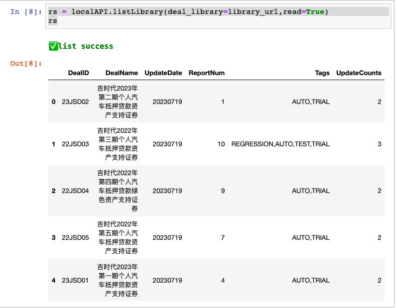

模型库(beta)
============

`模型库` 是部署于云端，包含已建模的产品集合,用户通过absbox API调用模型,进行测算,估值。

.. note::

   通过Python发起Web API调用,在服务器进行现金流计算,并且返回结果。
   模型库也可以单独部署于公网或者内网。

范围
--------

目前 `模型库` 公募信贷ABS市场慢速拓展中。如果有产品需要优先建模,请通过公众号进行留言

    * 微信公众号 ``ABS工匠``

对于特殊产品仅对个别用户开放，需单独创建用户和权限，请在公众号留言。

使用方式 
--------

认证
^^^^^^^^^

`library_url` 指向模型库服务器地址。

.. code-block:: python

    library_url = "https://absbox.org/library/latest"
    # 测试账户： 用户名test/密码test
    localAPI.loginLibrary("test","test",deal_library=library_url)

    ## 如果需要隐匿密码, 密码通过命令行输入
    localAPI.safeLogin("xyz",deal_library=library_url)

.. note::

   测试账户仅包含少部分产品查询和运行权限。  

查询所有可用债券
^^^^^^^^^^^^^^^^^^^

用户可以查询所有可用的债券（受限于访客权限）

.. code-block:: python

    rs = localAPI.listLibrary(deal_library=library_url
                             ,read=True
                             ,production=False)
    rs

查询特定债券
^^^^^^^^^^^^^

用户通过传入债券ID,以及筛选参数,发起模型库查询。

.. code-block:: python

    localAPI.queryLibrary(["22吉时代3A2_bc"],deal_library=library_url)

其他筛选参数：

.. code-block:: python

    localAPI.queryLibrary(["22吉时代3A2_bc"]
                          ,deal_library=library_url
                          ,read=True  # 是否返回为dataframe
                          ,production=True  # 是否只包括正式模型 
                          ,history=False # 是否包括历史模型 
                          ,and_tags=[]  # 必须包含所有列举的标签
                          ,or_tags=[]   # 任意包含列举的标签
                          )

运行
^^^^^^^^^
此步骤只需要传入

* 产品ID : `22JSD03` 为 前序步骤 查询的产品ID
* 模型库地址: 即 deal_library 
* runAssump: 产品假设
* poolAssump: 资产池表现假设
* reader: 如果中国产品选择 "china.SPV"

.. code-block:: python

    tt = localAPI.runLibrary("24FUYUAN01"
                             ,deal_library=library_url
                             ,runAssump = [("pricing", {"贴现日":"2024-07-02","贴现曲线":[["2020-01-01",0.03]
                                                                        ,["2030-01-01",0.03]]})]
                             ,poolAssump = ("Pool",
                                             ("Mortgage",{"CDR":0.01},None,None,None)
                                                        ,None
                                                        ,None
                                           )
                             
                             ,reader="china.SPV"
                             ,read=True
                             ,production=False))

返回值和 API.run() 一致。
